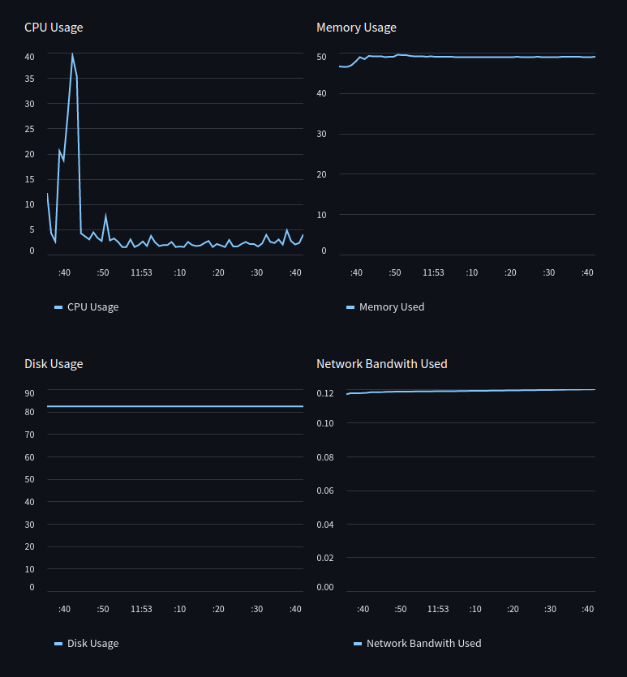

# System Resource Monitor

This is a Python program that monitors system resources such as CPU, memory, disk usage, network bandwidth, and logs historical data. Additionally, it includes a script to display all running processes on a Linux system during boot-up.

<div align="center">



</div>

## Getting Started

To use this program, you need to have Python 3.7 or higher installed on your system. You can install the required packages using pip or conda.

### Pip

``` Bash
pip install -r requirements.txt
```

### Conda

``` Bash
conda env create -f environment.yml
conda activate system-resource-monitor
```

## How to Run the Application

To run the system resource monitor, navigate to the project directory and execute the following command:

``` Bash
streamlit run src/__main__.py
```

The monitor will continuously monitor system resources and display real-time usage data on the screen. The monitor will also log historical data in a Pandas DataFrame, which can be used for analysis and visualization.

## Dependencies

The following packages are required to run the program:

* psutil
* streamlit
* pandas

These packages can be installed using pip or conda, as described in the "Getting Started" section.

## Contributing

We welcome contributions from the community. If you would like to contribute, please follow these steps:

1. Fork this repository
2. Create a new branch (`git checkout -b feature/my-feature`)
3. Make your changes and commit them (`git commit -am 'Add my feature'`)
4. Push to the branch (`git push origin feature/my-feature`)
5. Open a pull request

Please make sure your code follows the [PEP 8](https://www.python.org/dev/peps/pep-0008/) style guide and includes any necessary documentation or tests.

## License

This project is licensed under the MIT License. See the [LICENSE](LICENSE) file for details.
